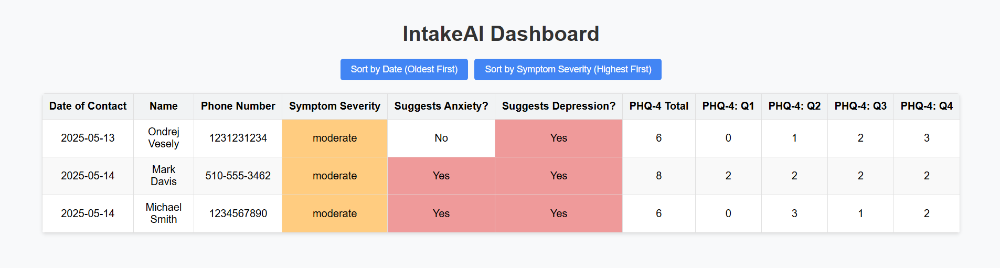

https://github.com/user-attachments/assets/bdad29ae-6a62-4c09-ba60-84d73f82cd8f
# IntakeAI
## Abstract
Access to mental health treatment faces large barriers when it comes to the 
intake process. It is often highly inefficient as a result of administrative 
bottlenecks resulting in missed calls and denied access to treatment. This 
project explores whether a conversational AI agent can be used to streamline 
intake for mental health treatment centers by handling calls, collecting key 
patient information, and conducting a brief screening. I built and deployed
a voice-based AI intake bot using Bland.AI and built a backend system to 
securely store caller data and screening results. I then evaluated the bot’s 
performance using an adapted version of the 3-bot evaluation framework with
GPT-4o acting as users with different personas. The results showed a high 
reliability in data collection accuracy, clarity, tone, and role adherence. 
These findings suggest that conversation AI can be a highly useful tool in 
reducing barriers to care at the earliest stages of the intake process.

## Research Publication
For detailed information, please see the entire research paper here:
[IntakeAI](IntakeAI.pdf).

## Demo
You can listen to a 3-minute long demo of GPT-4o roleplaying as a patient
interacting with the AI intake bot here:

https://github.com/user-attachments/assets/434308f1-5937-4616-b4ac-f1f41a76c207

After the call is ended, the dashboard will automatically add an entry with
the collected information. You can access the dashboard here:
https://neuro140.vercel.app/. As per the demo, “Mark Davis” was added there
automatically.

## Contributors
- Ondrej Vesely – Author

